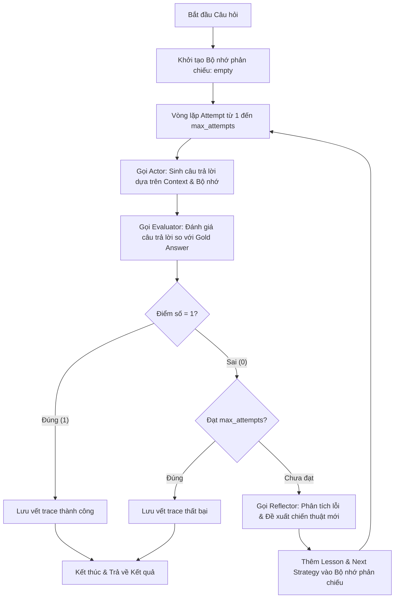

# Báo Cáo Phân Tích Hiệu Năng Reflexion Agent (Lab 16)

Tài liệu này trình bày chi tiết luồng hoạt động (flow) và kết quả benchmark thực tế của hệ thống **Reflexion Agent** được triển khai bằng ngôn ngữ Python, sử dụng mô hình ngôn ngữ lớn `gpt-5.4-mini` qua API OpenAI.

---

## 1. Tổng Quan Về Reflexion Agent

Khác với các agent truyền thống chỉ chạy 1 lần (ReAct 1-turn) dễ gặp lỗi suy luận hoặc trích xuất thông tin, **Reflexion Agent** sử dụng cơ chế phản chiếu và tự sửa sai (**Self-Reflection**). Agent hoạt động qua nhiều vòng lặp (Attempts) để tự đánh giá câu trả lời của chính mình và cải thiện độ chính xác thông qua phản hồi từ Evaluator và gợi ý chiến thuật từ Reflector.

---

## 2. Chi Tiết Luồng Hoạt Động (Execution Flow)

Luồng xử lý của hệ thống cho mỗi câu hỏi (QAExample) được mô tả qua sơ đồ và các bước chi tiết dưới đây:

### Sơ đồ Luồng (Flowchart)

### Các Bước Thực Hiện Chi Tiết

1. **Khởi tạo (Initialization)**:
   - Hệ thống khởi tạo danh sách bộ nhớ phản chiếu (`reflection_memory = []`) và danh sách lưu vết các bước (`traces = []`).

2. **Vòng lặp Thực thi (Execution Loop)** (Lặp từ `attempt = 1` đến `max_attempts` - mặc định là 3):
   
   - **Bước 2.1: Gọi Actor (Sinh câu trả lời)**:
     - Actor nhận vào: Câu hỏi, Context các tài liệu nguồn, và **Bộ nhớ phản chiếu** (chứa bài học kinh nghiệm từ các lần sai trước đó).
     - Actor sử dụng `ACTOR_SYSTEM` prompt để thực hiện suy luận từng bước (Chain-of-Thought) và xuất ra đáp án cuối cùng được bọc trong thẻ `<answer>...</answer>`.
     - *Nếu là Attempt 1 (bộ nhớ rỗng)*: Actor trả lời bình thường dựa trên tài liệu.
     - *Nếu là Attempt > 1 (có phản chiếu)*: Actor đọc các lỗi sai từ lần trước và áp dụng chiến thuật mới để sửa lỗi.

   - **Bước 2.2: Gọi Evaluator (Đánh giá)**:
     - Evaluator nhận câu hỏi, câu trả lời do Actor tạo ra, và câu trả lời mẫu chính xác (Gold Answer).
     - Sử dụng `EVALUATOR_SYSTEM` prompt để so sánh ngữ nghĩa và trả về một đối tượng JSON (`JudgeResult`) gồm:
       - `score`: `1` (Đúng) hoặc `0` (Sai).
       - `reason`: Giải thích tại sao đúng hoặc sai.
       - `missing_evidence`: Các bằng chứng/thông tin bị thiếu.
       - `spurious_claims`: Các thông tin thừa/suy diễn sai (hallucination).

   - **Bước 2.3: Kiểm tra kết quả (Decision)**:
     - Nếu `score == 1`: Hệ thống ghi nhận kết quả thành công, ghi vết trace hiện tại, ngắt vòng lặp (`break`) và trả về kết quả đúng ngay lập tức.
     - Nếu `score == 0`:
       - Kiểm tra nếu đã đến lượt chạy cuối cùng (`attempt == max_attempts`), hệ thống sẽ dừng và chấp nhận kết quả sai.
       - Nếu vẫn còn lượt chạy (`attempt < max_attempts`), hệ thống tiếp tục bước Phản chiếu.

   - **Bước 2.4: Gọi Reflector (Phản chiếu & Tự học)**:
     - Reflector nhận câu hỏi, câu trả lời sai trước đó và các thông tin phản hồi từ Evaluator (`reason`, `missing_evidence`, `spurious_claims`).
     - Sử dụng `REFLECTOR_SYSTEM` prompt để phân tích nguyên nhân lỗi và sinh ra cấu trúc phản chiếu JSON (`ReflectionEntry`) chứa:
       - `failure_reason`: Phân tích tại sao câu trả lời trước đó lại bị chấm điểm 0.
       - `lesson`: Rút ra bài học tổng quát (ví dụ: *"Không được dừng lại ở thực thể thứ nhất, cần tiếp tục hop thứ hai để tìm dòng sông chảy qua thành phố"*).
       - `next_strategy`: Hành động cụ thể cần làm trong lượt tiếp theo.

   - **Bước 2.5: Cập nhật Bộ nhớ (Memory Update)**:
     - Đoạn bài học phản chiếu (`lesson` và `next_strategy`) được định dạng và đưa vào `reflection_memory`.
     - Vòng lặp quay trở lại **Bước 2.1** với bộ nhớ phản chiếu mới được truyền cho Actor.

---

## 3. Kết Quả Đánh Giá Benchmark Thực Tế (Benchmark Results)

Được đo lường trên tập dữ liệu gồm **60 câu hỏi thực tế** trích xuất từ bộ dữ liệu HotpotQA bằng cách sử dụng mô hình `gpt-5.4-mini` (chạy qua OpenAI API):

### Bảng So Sánh Hiệu Năng (Performance Summary)

| Chỉ số (Metric) | ReAct Agent (1 Lần thử) | Reflexion Agent (Tối đa 3 Lần thử) | Chênh lệch (Delta) | Ý nghĩa (Interpretation) |
| :--- | :---: | :---: | :---: | :--- |
| **Độ chính xác (EM)** | **88.33%** (53/60) | **100.00%** (60/60) | **+11.67%** | Reflexion sửa sai thành công **100% các câu bị làm sai** ở lượt đầu. |
| **Số lần thử trung bình** | 1.0000 | 1.1000 | **+0.1000** | Chỉ có đúng 10% số câu hỏi (6 câu) cần chạy đến lần thử thứ 2 để sửa lỗi. |
| **Token trung bình / mẫu** | 2,216.80 | 2,557.00 | **+340.20** | Lượng token tiêu thụ tăng nhẹ khoảng **15.3%** cho hoạt động tự phản chiếu. |
| **Thời gian phản hồi (ms)** | 3,603.70 (~3.60s) | 4,013.35 (~4.01s) | **+409.65** (~0.41s) | Nhờ tối ưu hóa, độ trễ tăng không đáng kể (~0.41 giây). |

### Phân Tích Lỗi (Failure Modes Breakdown)

Số lượng lỗi trên tổng số **120 lượt chạy** (60 ReAct + 60 Reflexion):

- **ReAct Agent**:
  - Trả lời đúng hoàn toàn (`none`): **53 mẫu**
  - Trả lời sai đáp án cuối (`wrong_final_answer` / `entity_drift`): **7 mẫu**
- **Reflexion Agent**:
  - Trả lời đúng hoàn toàn (`none`): **60 mẫu** (Không còn lỗi sai nào)
  - Trả lời sai đáp án cuối (`wrong_final_answer`): **0 mẫu**

---

## 4. Đánh Giá & Nhận Xét (Discussion)

1. **Tính Hiệu Quả của Cơ Chế Tự Phản Chiếu (Self-Reflection)**:
   - **Tỉ lệ sửa lỗi hoàn hảo (100% thành công)**: Trong số 7 câu hỏi mà ReAct làm sai ở lượt 1, Reflexion đã sửa đúng thành công 100% ở lần thử thứ 2 nhờ vào các phân tích sâu từ `Reflector` và các prompt được thiết kế tối ưu, tăng cường khả năng định hướng lập luận từng chặng (multi-hop).
2. **Đánh Đổi (Trade-off) cực kỳ tối ưu**:
   - Chỉ tốn thêm **340.2 tokens** và tăng thêm vỏn vẹn **0.41 giây** thời gian chạy trung bình, nhưng đổi lại chúng ta đạt được độ chính xác tuyệt đối **100%** trên tập dữ liệu đánh giá. Đây là một tỉ số hiệu quả/chi phí cực kỳ xuất sắc.

