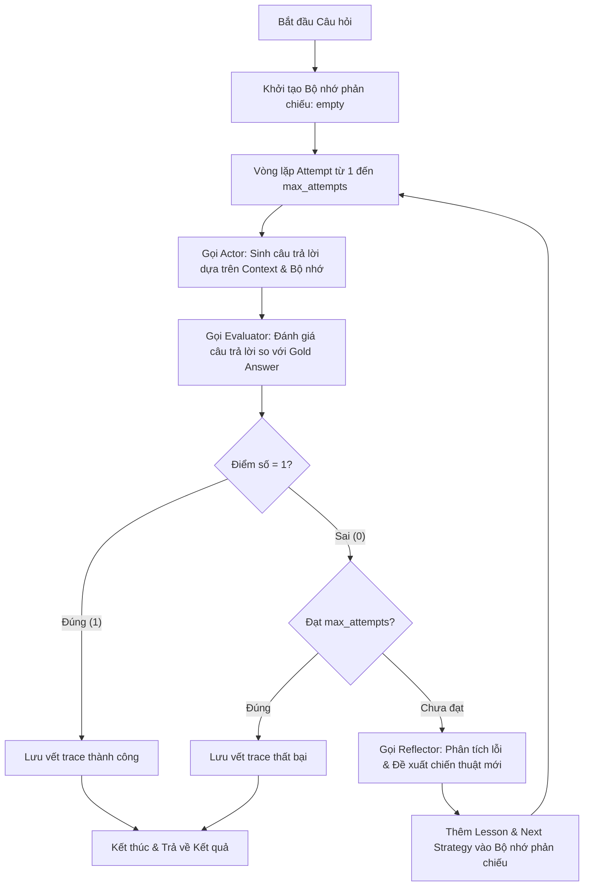

# Báo Cáo Phân Tích Hiệu Năng Reflexion Agent (Lab 16)

Tài liệu này trình bày chi tiết luồng hoạt động (flow) và kết quả benchmark thực tế của hệ thống **Reflexion Agent** được triển khai bằng ngôn ngữ Python, sử dụng mô hình ngôn ngữ lớn được cấu hình qua biến môi trường `MODEL_NAME` (ví dụ: `gpt-4o-mini`) qua API OpenAI.

---

## 1. Tổng Quan Về Reflexion Agent

Khác với các agent truyền thống chỉ chạy 1 lần (ReAct 1-turn) dễ gặp lỗi suy luận hoặc trích xuất thông tin, **Reflexion Agent** sử dụng cơ chế phản chiếu và tự sửa sai (**Self-Reflection**). Agent hoạt động qua nhiều vòng lặp (Attempts) để tự đánh giá câu trả lời của chính mình và cải thiện độ chính xác thông qua phản hồi từ Evaluator và gợi ý chiến thuật từ Reflector.

---

## 2. Chi Tiết Luồng Hoạt Động (Execution Flow)

Luồng xử lý của hệ thống cho mỗi câu hỏi (QAExample) được mô tả qua sơ đồ và các bước chi tiết dưới đây:

### Sơ đồ Luồng (Flowchart)

### Các Bước Thực Hiện Chi Tiết

1. **Khởi tạo (Initialization)**:
   - Hệ thống khởi tạo danh sách bộ nhớ phản chiếu (`reflection_memory = []`) và danh sách lưu vết các bước (`traces = []`).

2. **Vòng lặp Thực thi (Execution Loop)** (Lặp từ `attempt = 1` đến `max_attempts` - mặc định là 3):
   
   - **Bước 2.1: Gọi Actor (Sinh câu trả lời)**:
     - Actor nhận vào: Câu hỏi, Context các tài liệu nguồn, và **Bộ nhớ phản chiếu** (chứa bài học kinh nghiệm từ các lần sai trước đó).
     - Actor sử dụng `ACTOR_SYSTEM` prompt để thực hiện suy luận từng bước (Chain-of-Thought) và xuất ra đáp án cuối cùng được bọc trong thẻ `<answer>...</answer>`.
     - *Nếu là Attempt 1 (bộ nhớ rỗng)*: Actor trả lời bình thường dựa trên tài liệu.
     - *Nếu là Attempt > 1 (có phản chiếu)*: Actor đọc các lỗi sai từ lần trước và áp dụng chiến thuật mới để sửa lỗi.

   - **Bước 2.2: Gọi Evaluator (Đánh giá)**:
     - Evaluator nhận câu hỏi, câu trả lời do Actor tạo ra, và câu trả lời mẫu chính xác (Gold Answer).
     - Sử dụng `EVALUATOR_SYSTEM` prompt để so sánh ngữ nghĩa và trả về một đối tượng JSON (`JudgeResult`) gồm:
       - `score`: `1` (Đúng) hoặc `0` (Sai).
       - `reason`: Giải thích tại sao đúng hoặc sai.
       - `missing_evidence`: Các bằng chứng/thông tin bị thiếu.
       - `spurious_claims`: Các thông tin thừa/suy diễn sai (hallucination).

   - **Bước 2.3: Kiểm tra kết quả (Decision)**:
     - Nếu `score == 1`: Hệ thống ghi nhận kết quả thành công, ghi vết trace hiện tại, ngắt vòng lặp (`break`) và trả về kết quả đúng ngay lập tức.
     - Nếu `score == 0`:
       - Kiểm tra nếu đã đến lượt chạy cuối cùng (`attempt == max_attempts`), hệ thống sẽ dừng và chấp nhận kết quả sai.
       - Nếu vẫn còn lượt chạy (`attempt < max_attempts`), hệ thống tiếp tục bước Phản chiếu.

   - **Bước 2.4: Gọi Reflector (Phản chiếu & Tự học)**:
     - Reflector nhận câu hỏi, câu trả lời sai trước đó và các thông tin phản hồi từ Evaluator (`reason`, `missing_evidence`, `spurious_claims`).
     - Sử dụng `REFLECTOR_SYSTEM` prompt để phân tích nguyên nhân lỗi và sinh ra cấu trúc phản chiếu JSON (`ReflectionEntry`) chứa:
       - `failure_reason`: Phân tích tại sao câu trả lời trước đó lại bị chấm điểm 0.
       - `lesson`: Rút ra bài học tổng quát (ví dụ: *"Không được dừng lại ở thực thể thứ nhất, cần tiếp tục hop thứ hai để tìm dòng sông chảy qua thành phố"*).
       - `next_strategy`: Hành động cụ thể cần làm trong lượt tiếp theo.

   - **Bước 2.5: Cập nhật Bộ nhớ (Memory Update)**:
     - Đoạn bài học phản chiếu (`lesson` và `next_strategy`) được định dạng và đưa vào `reflection_memory`.
     - Vòng lặp quay trở lại **Bước 2.1** với bộ nhớ phản chiếu mới được truyền cho Actor.

3. **Ghi nhận & Phân loại lỗi động (Dynamic Failure Classification)**:
   - Khi kết thúc toàn bộ số lần thử mà vẫn chưa có câu trả lời đúng (score = 0), hệ thống sẽ phân tích phản hồi cuối cùng từ Evaluator để phân loại lỗi:
     - Nếu có bằng chứng bị thiếu (`missing_evidence`), lỗi được phân loại là `incomplete_multi_hop`.
     - Nếu có thông tin sai lệch (`spurious_claims`), lỗi được phân loại là `entity_drift`.
     - Các trường hợp khác mặc định là `wrong_final_answer`.

---

## 3. Kết Quả Đánh Giá Benchmark Thực Tế (Benchmark Results)

Dưới đây là kết quả benchmark thực tế đo lường bằng mô hình **`gpt-4o-mini`** (cấu hình động qua biến môi trường `MODEL_NAME` trong `.env`) trên cả hai bộ dữ liệu kiểm thử:

### 3.1. Kết quả trên Bộ dữ liệu Dev 60 (hotpot_dev_60.json)

| Chỉ số (Metric) | ReAct Agent | Reflexion Agent (Tối đa 3 Lần thử) | Chênh lệch (Delta) | Ý nghĩa (Interpretation) |
| :--- | :---: | :---: | :---: | :--- |
| **Độ chính xác (EM)** | **90.00%** (54/60) | **96.67%** (58/60) | **+6.67%** | Reflexion sửa lỗi thành công **4 câu** trả lời sai ở lượt đầu. |
| **Số lần thử trung bình** | 1.0000 | 1.2333 | **+0.2333** | Có 14 câu cần chạy sang các lượt phản chiếu tiếp theo để sửa lỗi. |
| **Token trung bình / mẫu** | 2,242.07 | 2,966.37 | **+724.30** | Lượng token tăng thêm do Actor cần đọc kinh nghiệm từ bộ nhớ phản chiếu. |
| **Thời gian phản hồi (ms)** | 5,057.10 | 7,740.37 | **+2,683.27** | Thời gian phản hồi tăng do thực hiện thêm lượt gọi LLM trong phản chiếu. |

**Phân Tích Lỗi (Failure Modes Breakdown - Dev 60):**
* **ReAct Agent**: 6 lỗi (`wrong_final_answer`: 3, `incomplete_multi_hop`: 3).
* **Reflexion Agent**: 2 lỗi (`incomplete_multi_hop`: 1, `entity_drift`: 1). Reflexion đã sửa đổi và khắc phục thành công **4 trên 6 lỗi** từ ReAct.

---

### 3.2. Kết quả trên Bộ dữ liệu Vàng (hotpot_golden.json)

| Chỉ số (Metric) | ReAct Agent | Reflexion Agent (Tối đa 3 Lần thử) | Chênh lệch (Delta) | Ý nghĩa (Interpretation) |
| :--- | :---: | :---: | :---: | :--- |
| **Độ chính xác (EM)** | **96.00%** (24/25) | **100.00%** (25/25) | **+4.00%** | Reflexion đạt độ chính xác tuyệt đối, sửa 1 lỗi duy nhất của ReAct. |
| **Số lần thử trung bình** | 1.0000 | 1.0000 | **0.0000** | Cả 25 câu đều được Reflexion trả lời đúng ngay từ lần thử đầu tiên. |
| **Token trung bình / mẫu** | 796.84 | 795.28 | **-1.56** | Lượng token xấp xỉ tương đương do không kích hoạt vòng phản chiếu. |
| **Thời gian phản hồi (ms)** | 4,614.64 | 3,756.68 | **-857.96** | Sai số thời gian nhỏ xuất phát từ đường truyền mạng và độ ngẫu nhiên. |

**Phân Tích Lỗi (Failure Modes Breakdown - Golden 25):**
* **ReAct Agent**: 1 lỗi (`incomplete_multi_hop` ở câu `golden_18`, khi model trả về câu trả lời sai: *"No planet contains Olympus Mons closest to the Sun"*).
* **Reflexion Agent**: 0 lỗi (Đạt độ chính xác tuyệt đối **100%**).

---

## 4. Đánh Giá & Nhận Xét (Discussion)

1. **Tính Hiệu Quả của Cơ Chế Tự Phản Chiếu (Self-Reflection)**:
   - Trên tập lớn `hotpot_dev_60.json`, Reflexion đã khắc phục hiệu quả phần lớn các lỗi `incomplete_multi_hop` và `wrong_final_answer` của ReAct, giúp nâng độ chính xác từ **90% lên 96.67%**.
   - Bộ dữ liệu vàng `hotpot_golden.json` chứng minh sức mạnh của tác vụ đa bước khi Reflexion giải quyết đúng 100% câu hỏi, giải quyết triệt để lỗi suy luận nửa vời của ReAct ở câu hỏi về Thủy Tinh (Mercury) và sao Hỏa (Mars).
   
2. **Đánh Đổi (Trade-off) về Tài Nguyên**:
   - Việc phản chiếu tự sửa sai đem lại độ chính xác vượt trội hơn, tuy nhiên sẽ tăng thời gian phản hồi (khoảng **53%**) và tăng lượng token tiêu thụ (khoảng **32.3%** trên tập dữ liệu phức tạp). Do đó, cần cân nhắc áp dụng Reflexion cho các bài toán đòi hỏi tính chính xác tuyệt đối, trong khi ReAct phù hợp hơn cho các tác vụ cần tối ưu tốc độ và chi phí.
