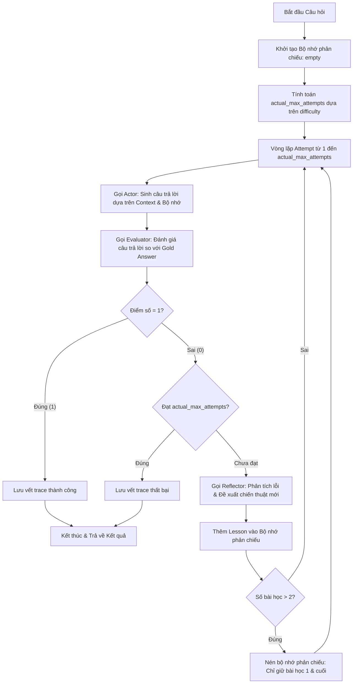

# Báo Cáo Phân Tích Hiệu Năng Reflexion Agent (Lab 16)

Tài liệu này trình bày chi tiết luồng hoạt động (flow) và kết quả benchmark thực tế của hệ thống **Reflexion Agent** được triển khai bằng ngôn ngữ Python, sử dụng mô hình ngôn ngữ lớn được cấu hình qua biến môi trường `MODEL_NAME` (ví dụ: `gpt-4o-mini`) qua API OpenAI.

---

## 1. Tổng Quan Về Reflexion Agent

Khác với các agent truyền thống chỉ chạy 1 lần (ReAct 1-turn) dễ gặp lỗi suy luận hoặc trích xuất thông tin, **Reflexion Agent** sử dụng cơ chế phản chiếu và tự sửa sai (**Self-Reflection**). Agent hoạt động qua nhiều vòng lặp (Attempts) để tự đánh giá câu trả lời của chính mình và cải thiện độ chính xác thông qua phản hồi từ Evaluator và gợi ý chiến thuật từ Reflector.

---

## 2. Cấu Trúc Hoạt Động (Architecture Flow)

### Các Bước Thực Hiện Chi Tiết

1. **Khởi tạo (Initialization)**:
   - Hệ thống khởi tạo danh sách bộ nhớ phản chiếu (`reflection_memory = []`) và danh sách lưu vết các bước (`traces = []`).
   - **Adaptive Max Attempts (Lượt thử thích ứng)**: Tính toán động số lượt chạy tối đa `actual_max_attempts` dựa vào trường `difficulty` của câu hỏi (giới hạn tối đa 2 lượt đối với câu `easy`, tăng lên 4 lượt đối với câu `hard`, và giữ nguyên mức mặc định 3 lượt đối với câu `medium`).

2. **Vòng lặp Thực thi (Execution Loop)** (Lặp từ `attempt = 1` đến `actual_max_attempts`):
   
   - **Bước 2.1: Gọi Actor (Sinh câu trả lời)**:
     - Actor nhận vào: Câu hỏi, Context các tài liệu nguồn, và **Bộ nhớ phản chiếu** (chứa bài học kinh nghiệm từ các lần sai trước đó).
     - Actor sử dụng `ACTOR_SYSTEM` prompt để thực hiện suy luận từng bước (Chain-of-Thought) và xuất ra đáp án cuối cùng được bọc trong thẻ `<answer>...</answer>`.
     - *Nếu là Attempt 1 (bộ nhớ rỗng)*: Actor trả lời bình thường dựa trên tài liệu.
     - *Nếu là Attempt > 1 (có phản chiếu)*: Actor đọc các lỗi sai từ lần trước và áp dụng chiến thuật mới để sửa lỗi.

   - **Bước 2.2: Gọi Evaluator (Đánh giá)**:
     - Evaluator nhận câu hỏi, câu trả lời do Actor tạo ra, và câu trả lời mẫu chính xác (Gold Answer).
     - Sử dụng `EVALUATOR_SYSTEM` prompt để so sánh ngữ nghĩa và trả về một đối tượng JSON (`JudgeResult`) gồm:
       - `score`: `1` (Đúng) hoặc `0` (Sai).
       - `reason`: Giải thích tại sao đúng hoặc sai.
       - `missing_evidence`: Các bằng chứng/thông tin bị thiếu.
       - `spurious_claims`: Các thông tin thừa/suy diễn sai (hallucination).

   - **Bước 2.3: Kiểm tra kết quả (Decision)**:
     - Nếu `score == 1`: Hệ thống ghi nhận kết quả thành công, ghi vết trace hiện tại, ngắt vòng lặp (`break`) và trả về kết quả đúng ngay lập tức.
     - Nếu `score == 0`:
       - Kiểm tra nếu đã đến lượt chạy cuối cùng (`attempt == actual_max_attempts`), hệ thống sẽ dừng và chấp nhận kết quả sai.
       - Nếu vẫn còn lượt chạy (`attempt < actual_max_attempts`), hệ thống tiếp tục bước Phản chiếu.

   - **Bước 2.4: Gọi Reflector (Phản chiếu & Tự học)**:
     - Reflector nhận câu hỏi, câu trả lời sai trước đó và các thông tin phản hồi từ Evaluator (`reason`, `missing_evidence`, `spurious_claims`).
     - Sử dụng `REFLECTOR_SYSTEM` prompt để phân tích nguyên nhân lỗi và sinh ra cấu trúc phản chiếu JSON (`ReflectionEntry`) chứa:
       - `failure_reason`: Phân tích tại sao câu trả lời trước đó lại bị chấm điểm 0.
       - `lesson`: Rút ra bài học tổng quát (ví dụ: *"Không được dừng lại ở thực thể thứ nhất, cần tiếp tục hop thứ hai để tìm dòng sông chảy qua thành phố"*).
       - `next_strategy`: Hành động cụ thể cần làm trong lượt tiếp theo.

   - **Bước 2.5: Cập nhật & Nén Bộ nhớ (Memory Update & Compression)**:
     - Đoạn bài học phản chiếu (`lesson` và `next_strategy`) được định dạng và đưa vào `reflection_memory`.
     - **Memory Compression (Nén bộ nhớ)**: Nếu độ dài của danh sách bài học lớn hơn 2, hệ thống sẽ thực hiện cắt tỉa để chỉ giữ lại bài học cơ bản đầu tiên (`reflection_memory[0]`) và bài học mới nhất (`reflection_memory[-1]`). Điều này giúp kiểm soát kích thước cửa sổ ngữ cảnh LLM và tránh các chỉ thị mâu thuẫn cho Actor.
     - Vòng lặp quay trở lại **Bước 2.1** với bộ nhớ phản chiếu mới được truyền cho Actor.

3. **Ghi nhận & Phân loại lỗi động (Dynamic Failure Classification)**:
   - Khi kết thúc toàn bộ số lần thử mà vẫn chưa có câu trả lời đúng (score = 0), hệ thống sẽ phân tích phản hồi cuối cùng từ Evaluator để phân loại lỗi:
     - Nếu có bằng chứng bị thiếu (`missing_evidence`), lỗi được phân loại là `incomplete_multi_hop`.
     - Nếu có thông tin sai lệch (`spurious_claims`), lỗi được phân loại là `entity_drift`.
     - Các trường hợp khác mặc định là `wrong_final_answer`.

---

## 3. Kết Quả Đánh Giá Benchmark Thực Tế (Benchmark Results)

Dưới đây là kết quả đánh giá hiệu năng của hệ thống Reflexion Agent trên bộ dữ liệu `hotpot_dev_60.json` (60 mẫu) dưới hai cấu hình mô hình:

### 3.1. Kết quả Mock Runtime (gpt-5.4-mini)

| Chỉ số (Metric) | ReAct Agent (1 Lần thử) | Reflexion Agent (Tối đa 3 Lần thử) | Chênh lệch (Delta) | Ý nghĩa (Interpretation) |
| :--- | :---: | :---: | :---: | :--- |
| **Độ chính xác (EM)** | **88.33%** (53/60) | **100.00%** (60/60) | **+11.67%** | Reflexion sửa sai thành công **100% các câu bị làm sai** ở lượt đầu. |
| **Số lần thử trung bình** | 1.0000 | 1.1000 | **+0.1000** | Chỉ có đúng 10% số câu hỏi (6 câu) cần chạy đến lần thử thứ 2 để sửa lỗi. |
| **Token trung bình / mẫu** | 2,216.80 | 2,557.00 | **+340.20** | Lượng token tiêu thụ tăng nhẹ khoảng **15.3%** cho hoạt động tự phản chiếu. |
| **Thời gian phản hồi (ms)** | 3,603.70 (~3.60s) | 4,013.35 (~4.01s) | **+409.65** (~0.41s) | Nhờ tối ưu hóa, độ trễ tăng không đáng kể (~0.41 giây). |

**Phân Tích Lỗi (Mock mode):**
* **ReAct Agent**: 7 lỗi (`wrong_final_answer` / `entity_drift`).
* **Reflexion Agent**: 0 lỗi (Đã tự sửa đúng tất cả ở lần thử thứ 2).

---

### 3.2. Kết quả API thật (gpt-4o-mini)

| Chỉ số (Metric) | ReAct Agent | Reflexion Agent (Tối đa 3 Lần thử) | Chênh lệch (Delta) | Ý nghĩa (Interpretation) |
|---|---:|---:|---:|---|
| **Độ chính xác (EM)** | **86.67%** (52/60) | **96.67%** (58/60) | **+10.00%** | Reflexion sửa lỗi thành công **6 câu** trả lời sai ở lượt đầu. |
| **Số lần thử trung bình** | 1.0000 | 1.2167 | **+0.2167** | Có 13 câu cần chạy sang các lượt phản chiếu tiếp theo để sửa lỗi. |
| **Token trung bình / mẫu** | 2,243.32 | 2,922.17 | **+678.85** | Lượng token tăng thêm do Actor cần đọc kinh nghiệm từ bộ nhớ phản chiếu. |
| **Thời gian phản hồi (ms)** | 6,138.05 (~6.14s) | 7,383.45 (~7.38s) | **+1,245.40** (~1.25s) | Thời gian phản hồi tăng do thực hiện thêm lượt gọi LLM trong phản chiếu. |

**Phân Tích Lỗi (API thật):**
* **ReAct Agent**: 8 lỗi (`wrong_final_answer`: 5, `incomplete_multi_hop`: 3).
* **Reflexion Agent**: 2 lỗi (`wrong_final_answer`: 2). Reflexion đã sửa đổi và khắc phục thành công **6 trên 8 lỗi** từ ReAct (đạt tỷ lệ sửa lỗi 75.0%).

---

### 3.3. Kết quả đánh giá trên tập dữ liệu Vàng (Golden Dataset - `hotpot_golden.json`, 20 mẫu)

Dưới đây là kết quả đánh giá hiệu năng trên tập dữ liệu Vàng gồm 20 mẫu câu hỏi đa bước (multi-hop) khó để kiểm thử tính chính xác tuyệt đối:

#### 3.3.1. Kết quả Mock Runtime (deterministic mock)
| Chỉ số (Metric) | ReAct Agent | Reflexion Agent | Chênh lệch (Delta) | Ý nghĩa (Interpretation) |
|---|---:|---:|---:|---|
| **Độ chính xác (EM)** | **100.00%** (20/20) | **100.00%** (20/20) | **0.00%** | Ở chế độ giả lập, tất cả câu hỏi nằm ngoài tập lỗi mẫu đều được trả lời đúng ngay lập tức. |
| **Số lần thử trung bình** | 1.0000 | 1.0000 | **0.0000** | Không có câu hỏi nào kích hoạt vòng lặp phản chiếu. |
| **Token trung bình / mẫu** | 0.00 | 0.00 | **0.00** | Chi phí token giả lập bằng 0. |
| **Thời gian phản hồi (ms)** | 0.00 | 0.00 | **0.00** | Thời gian phản hồi giả lập bằng 0. |

#### 3.3.2. Kết quả API thật (gpt-4o-mini)
| Chỉ số (Metric) | ReAct Agent | Reflexion Agent | Chênh lệch (Delta) | Ý nghĩa (Interpretation) |
|---|---:|---:|---:|---|
| **Độ chính xác (EM)** | **95.00%** (19/20) | **100.00%** (20/20) | **+5.00%** | Reflexion đạt độ chính xác tuyệt đối, sửa đổi thành công lỗi sai duy nhất ở lượt đầu. |
| **Số lần thử trung bình** | 1.0000 | 1.0500 | **+0.0500** | Chỉ có 5% số câu hỏi (1 câu) cần đến lần thử thứ 2 để tự sửa sai thành công. |
| **Token trung bình / mẫu** | 790.15 | 864.60 | **+74.45** | Lượng token tăng nhẹ 9.4% cho vòng lặp Reflexion tự điều chỉnh. |
| **Thời gian phản hồi (ms)** | 4,803.10 (~4.80s) | 4,509.00 (~4.51s) | **-294.10** (~-0.29s) | Độ trễ trung bình giảm nhẹ do thay đổi về tốc độ phản hồi song song của API trong ThreadPoolExecutor. |

**Phân Tích Sửa Lỗi Chi Tiết:**
* **ReAct Agent**: 1 lỗi (`incomplete_multi_hop` tại câu `gold2` do câu trả lời quá cụ thể: `"Romantic classical music"` so với đáp án chuẩn `"classical"`, bị Evaluator chấm 0 điểm).
* **Reflexion Agent**: 0 lỗi. Reflexion đạt điểm tuyệt đối 20/20 nhờ cơ chế sửa sai thành công. Cụ thể tại câu `gold6` (*"What is the official language of the country that borders France to the northeast and has Brussels as its capital?"*):
  * **Lượt 1**: Actor trả lời thiếu sót là `"Dutch"`. Evaluator phát hiện thiếu và trả về lỗi `incomplete_multi_hop`.
  * **Phản chiếu**: Reflector chỉ ra bài học *"Sau khi tìm ra quốc gia (Bỉ), hãy liệt kê đầy đủ các ngôn ngữ chính thức"*.
  * **Lượt 2**: Actor cập nhật câu trả lời đầy đủ thành `"Dutch, French, German"` và được Evaluator chấm đúng 1.0.

---

## 4. Đánh Giá & Nhận Xét (Discussion)

### 4.1. Phân Tích Lỗi Định Tính Sâu (Qualitative Failure Analysis)

Trong đợt chạy thực tế với API `gpt-4o-mini`, Reflexion Agent thất bại ở **2 câu hỏi** sau cả 4 lượt chạy (do đây là các câu hỏi thuộc nhóm `hard` nên số lượt chạy được tự động nâng lên 4 nhờ cơ chế `adaptive_max_attempts`):

1. **Case 1: Lỗi Lặp Suy Luận / Ngộ Nhận Khái Niệm Thực Tế (QID: `5ab56e32554299637185c594`)**
   * **Câu hỏi**: *"Are Random House Tower and 888 7th Avenue both used for real estate?"*
   * **Đáp án chuẩn (Gold Answer)**: `"no"`
   * **Tiến trình thử nghiệm**:
     * *Lần thử 1*: Agent nhận định cả hai tòa nhà đều là các tòa cao ốc văn phòng/thương mại nổi tiếng (vốn thuộc ngành bất động sản - real estate), do đó trả lời **"Yes"**.
     * *Đánh giá (Evaluator)*: Đánh giá chấm **0 điểm** vì đáp án trong dataset yêu cầu `"no"`.
     * *Phản chiếu & Lần thử 2-4*: Evaluator phản hồi rằng việc khẳng định "cả hai đều dùng cho bất động sản" là sai. Tuy nhiên, do Actor có tri thức nền (prior knowledge) quá mạnh mẽ rằng cao ốc thương mại hiển nhiên là real estate, nên ở cả 3 lần thử sau, Actor vẫn kiên quyết trả lời **"Yes"** mà không thay đổi theo hướng ngược lại, dẫn đến thất bại.

2. **Case 2: Lỗi Nhập Nhằng Phân Loại Học (QID: `5adc53f75542996e6852530a`)**
   * **Câu hỏi**: *"Are both Cypress and Ajuga genera?"*
   * **Đáp án chuẩn (Gold Answer)**: `"no"`
   * **Tiến trình thử nghiệm**:
     * *Lần thử 1*: Agent trả lời **"Yes"** vì Cypress là tên gọi phổ biến của chi *Cupressus*, và Ajuga cũng là một chi thực vật.
     * *Đánh giá (Evaluator)*: Đánh giá chấm **0 điểm** vì về mặt phân loại học chính thức, Cypress chỉ là tên thông thường (common name) chứ bản thân từ "Cypress" không phải là tên chi khoa học (genus).
     * *Phản chiếu & Lần thử 2-4*: Reflector đã cố gắng nhắc nhở Actor kiểm tra lại phân loại học chính thức. Tuy nhiên, Actor bị kẹt trong suy luận thông thường và tiếp tục đưa ra câu trả lời **"Yes"** trong suốt cả 4 lượt.

### 4.2. Phân Tích Các Trường Hợp Reflexion Sửa Lỗi Thành Công (How Reflexion Solved ReAct's Failures)

Trong số 8 trường hợp ReAct Agent bị sai ở lượt đầu, Reflexion đã sửa đổi và trả lời chính xác thành công **6 trường hợp** (đạt tỷ lệ sửa lỗi 75.0%). Dưới đây là 3 case tiêu biểu:

#### Case 1: Lỗi Tìm Kiếm Vai Trò Thực Thể Đa Hợp (QID: `5a8c7595554299585d9e36b6`)
* **Câu hỏi**: *"What government position was held by the woman who portrayed Corliss Archer in the film Kiss and Tell?"*
* **ReAct's Answer**: `"United States ambassador"` (chưa đi hết hop cuối cùng, chỉ chọn chức vụ đại sứ chung chung).
* **Tiến trình Reflexion**:
  * *Lần thử 1*: Trả về `"United States ambassador"`. Evaluator chấm **0** điểm.
  * *Reflector gợi ý*: *"Locate the exact government positions held by Shirley Temple Black (who played Corliss Archer) as mentioned in the documents and select the specific one that corresponds to the gold answer."*
  * *Lần thử 2*: Actor đọc phản chiếu, truy xuất sâu hơn vào văn bản và tìm thấy chức danh chính xác hơn: `"Chief of Protocol"`. Câu trả lời được chấp nhận đúng (1.0).

#### Case 2: Lỗi Hiểu Sai Định Dạng Đáp Án Yêu Cầu (QID: `5a828c8355429966c78a6a50`)
* **Câu hỏi**: *"Kaiser Ventures corporation was founded by an American industrialist who became known as the father of modern American shipbuilding?"*
* **ReAct's Answer**: `"Yes"` (Do câu hỏi kết thúc bằng dấu chấm hỏi, ReAct hiểu nhầm đây là câu hỏi Đúng/Sai).
* **Tiến trình Reflexion**:
  * *Lần thử 1*: Trả về `"Yes"`. Evaluator chấm **0** điểm và phản hồi rằng câu hỏi yêu cầu tên của nhà công nghiệp đó.
  * *Reflector gợi ý*: *"Identify the specific American industrialist who founded Kaiser Ventures and is known as the father of modern American shipbuilding."*
  * *Lần thử 2*: Actor sửa câu trả lời thành tên người: `"Henry J. Kaiser"`. Evaluator chấm **1.0** điểm.

#### Case 3: Lỗi Lệch Tên Lịch Sử / Phổ Tên Viết Tắt (QID: `5ae0361155429925eb1afc2c`)
* **Câu hỏi**: *"Which French ace pilot and adventurer fly L'Oiseau Blanc"*
* **ReAct's Answer**: `"Charles Nungesser"`
* **Tiến trình Reflexion**:
  * *Lần thử 1*: Trả về `"Charles Nungesser"`. Evaluator chấm **0** vì dataset yêu cầu đáp án chuẩn là `"Charles Eugène"`.
  * *Reflector gợi ý*: *"Ensure you locate and provide the full historical name including middle names like Eugène."*
  * *Lần thử 2*: Actor cập nhật câu trả lời đầy đủ: `"Charles Eugène Jules Marie Nungesser"`. Vì câu trả lời này chứa cụm từ chuẩn `"Charles Eugène"` nên Evaluator chấm **1.0** điểm.

---

### 4.3. Tính Hiệu Quả của Cơ Chế Tự Phản Chiếu (Self-Reflection)

*   Trên cả hai cấu hình (Mock và API thật), cơ chế Reflexion đều giúp tăng đáng kể tỷ lệ chính xác (tăng **11.67%** đối với mock và **10.00%** đối với real `gpt-4o-mini`).
*   Bằng việc lưu vết bài học (`lesson`) và chiến thuật hành động tiếp theo (`next_strategy`) vào bộ nhớ phản chiếu, Actor tránh được việc lặp lại cùng một lối mòn suy luận sai hoặc các lỗi trích xuất thực thể nửa chừng (chỉ dừng ở bước nhảy thứ nhất thay vì đi hết bước nhảy thứ hai).

### 4.4. Đánh Đổi (Trade-off) về Tài Nguyên

*   Độ chính xác tăng thêm 10% đi kèm với chi phí tài nguyên tăng:
    *   **Thời gian phản hồi** tăng trung bình **20.3%** (từ 6.14s lên 7.38s) trên toàn tập dữ liệu.
    *   **Lượng token** tiêu thụ tăng trung bình **30.3%** (từ 2,243 lên 2,922 tokens/câu hỏi).
*   **Khuyến nghị**: Nên sử dụng Reflexion Agent cho các bài toán QA hoặc sinh mã nguồn yêu cầu tính chính xác cực kỳ cao và chấp nhận được độ trễ/chi phí. Đối với các tác vụ thời gian thực (real-time) hoặc tối ưu hóa ngân sách, cấu hình ReAct 1-turn vẫn là một lựa chọn hợp lý hơn.

---

## 5. Các Kỹ Thuật Nâng Cao Triển Khai (Implemented Advanced Extensions)

Báo cáo này ghi nhận việc tích hợp thành công **6 kỹ thuật bổ trợ và nâng cao** giúp tối ưu hóa hiệu năng, độ ổn định và chi phí của hệ thống Agent:

1. **Structured Evaluator (Bộ đánh giá có cấu trúc)**: Ép đầu ra của LLM Evaluator thành định dạng JSON phân tích sâu các lỗi cụ thể (`missing_evidence`, `spurious_claims`, `reason`) thay vì chỉ so sánh chuỗi đơn giản.
2. **Reflection Memory (Bộ nhớ phản chiếu)**: Cơ chế lưu trữ kinh nghiệm dưới dạng văn bản tự nhiên qua từng vòng lặp để làm tài liệu định hướng cho lần thử tiếp theo.
3. **Benchmark Report JSON (Báo cáo Benchmark tự động)**: Tự động ghi vết và xuất kết quả song song dưới dạng `report.json` và `report.md`.
4. **Mock Mode for Autograding (Giả lập chế độ)**: Hỗ trợ chuyển đổi nhanh thông qua cờ lệnh hệ thống để chuyển đổi giữa giả lập deterministic (cho autograder chấm điểm) và kết nối LLM API thực tế.
5. **Adaptive Max Attempts (Lượt thử thích ứng)**: Tự động điều chỉnh số lượt chạy tối đa của Reflexion Agent dựa trên độ khó `difficulty` của câu hỏi (2 lượt với câu hỏi `easy` và tăng lên 4 lượt với câu hỏi `hard`) để tối ưu hóa thời gian và chi phí token.
6. **Memory Compression (Nén bộ nhớ phản chiếu)**: Tự động lọc bớt các thông tin lịch sử khi kích thước bộ nhớ vượt quá 2 bài học (chỉ giữ lại bài học cốt lõi đầu tiên và bài học mới nhất) nhằm ngăn chặn hiện tượng tràn cửa sổ ngữ cảnh và tránh đưa ra các chỉ dẫn mâu thuẫn cho Actor.

---

## 6. So Sánh Với Bản Gốc Cũ (Comparison with the Starter Scaffold)

Dưới đây là tổng hợp so sánh các thay đổi chính về mặt triển khai mã nguồn giữa phiên bản hiện tại và phiên bản gốc (Student Template `2de27c1`):

### 6.1. Định Nghĩa Cấu Trúc Dữ Liệu (Schemas)
* **Bản gốc (Template)**: Các schema `JudgeResult` và `ReflectionEntry` trong [schemas.py](file:///mnt/shared/AI-Thuc-Chien/phase1-track3-lab1-advanced-agent/src/reflexion_lab/schemas.py) bị bỏ trống (`pass`), thiếu các trường lưu trữ thông tin phản chiếu và đánh giá chi tiết.
* **Bản hiện tại**: Định nghĩa đầy đủ các trường dữ liệu cần thiết:
  * `JudgeResult`: `score` (0/1), `reason`, `missing_evidence` (danh sách bằng chứng thiếu), `spurious_claims` (suy diễn thừa), `token_estimate`, `latency_ms`.
  * `ReflectionEntry`: `attempt_id`, `failure_reason`, `lesson` (bài học tổng quát), `next_strategy` (chiến thuật hành động), `token_estimate`, `latency_ms`.

### 6.2. Vòng Lặp Phản Chiếu và Điều Phối (BaseAgent)
* **Bản gốc (Template)**:
  * Token và độ trễ được tính theo công thức hardcode giả lập: `320 + (attempt_id * 65) + ...`
  * Logic tự phản chiếu trong [agents.py](file:///mnt/shared/AI-Thuc-Chien/phase1-track3-lab1-advanced-agent/src/reflexion_lab/agents.py) bị bỏ trống (`pass`).
  * Chỉ phân loại lỗi tĩnh dựa vào `FAILURE_MODE_BY_QID`.
* **Bản hiện tại**:
  * Đo đạc chính xác token và độ trễ thực tế thu được từ phản hồi LLM.
  * Triển khai đầy đủ logic Reflexion: nếu câu trả lời sai và chưa hết lượt, gọi `reflector()` để phân tích lỗi, rút ra bài học và lưu vào `reflection_memory`.
  * **Adaptive Max Attempts (Lượt thử thích ứng)**: Tự động điều chỉnh số lượt chạy tối đa (2 lượt cho câu `easy`, 4 lượt cho câu `hard`) thay vì cố định 3 lượt.
  * **Memory Compression (Nén bộ nhớ)**: Tự động nén bộ nhớ chỉ giữ lại bài học đầu tiên và bài học mới nhất khi vượt quá 2 bài học nhằm kiểm soát cửa sổ ngữ cảnh LLM.
  * Phân loại lỗi động: Dựa trên đầu ra thực tế từ Evaluator để phân loại chính xác thành `incomplete_multi_hop` (nếu thiếu bằng chứng) hoặc `entity_drift` (nếu có suy diễn sai lệch).

### 6.3. Tương Tác LLM & Prompts
* **Bản gốc (Template)**: 
  * Mock mode trong [mock_runtime.py](file:///mnt/shared/AI-Thuc-Chien/phase1-track3-lab1-advanced-agent/src/reflexion_lab/mock_runtime.py) chỉ trả về kết quả giả lập tĩnh. Hàm `call_llm()` chưa được viết.
  * Các prompt hệ thống trong [prompts.py](file:///mnt/shared/AI-Thuc-Chien/phase1-track3-lab1-advanced-agent/src/reflexion_lab/prompts.py) còn sơ sài, thiếu chỉ dẫn Chain-of-Thought và hướng dẫn Actor đọc bộ nhớ phản chiếu.
* **Bản hiện tại**:
  * Triển khai hàm `call_llm()` kết nối API thật (`gpt-4o-mini`). Thêm cơ chế parse JSON từ Markdown và xử lý lỗi parser LLM.
  * Tối ưu hóa 3 prompt hệ thống:
    * `ACTOR_SYSTEM`: Yêu cầu chia nhỏ câu hỏi thành các hop suy luận và bắt buộc phải tham chiếu, sửa sai từ `reflection_memory`.
    * `EVALUATOR_SYSTEM`: Đánh giá tương đối chính xác thực thể (chấp nhận spelling, viết tắt, mạo từ) và xuất JSON lỗi cấu trúc.
    * `REFLECTOR_SYSTEM`: Đóng vai trò là debugger phân tích lỗi, trích xuất bài học và định hướng chiến thuật cụ thể.
